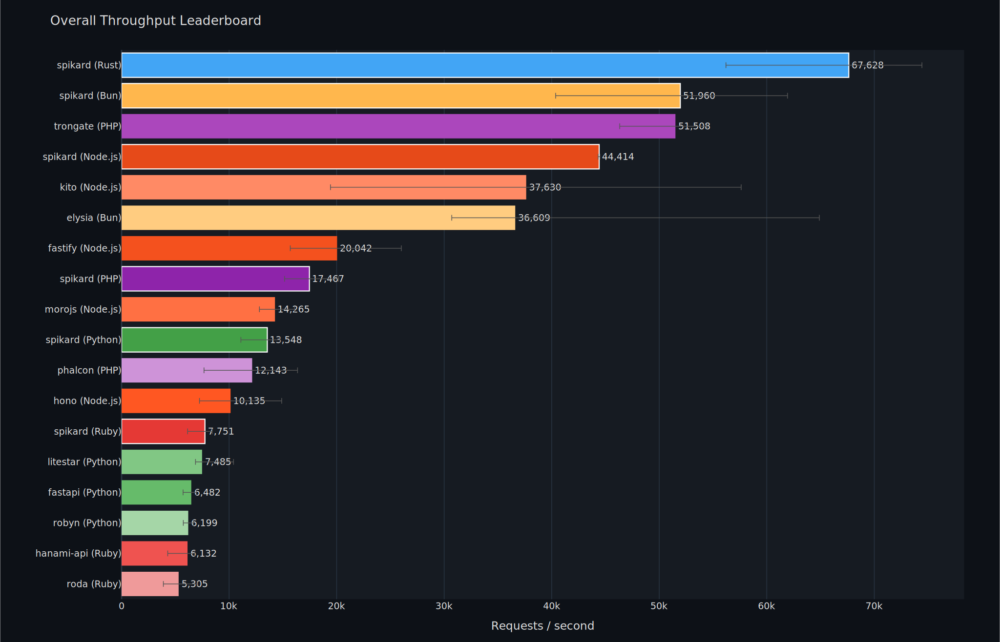

# Spikard

A Rust-centric multi-language toolkit for building and validating typed web services. Generate type-safe API handlers from OpenAPI, GraphQL, gRPC/Protobuf, AsyncAPI, or JSON-RPC specifications and deploy to Python, TypeScript, Ruby, PHP, or WebAssembly.

[](https://www.rust-lang.org/)
[](https://www.python.org/)
[](https://www.typescriptlang.org/)
[](https://www.ruby-lang.org/)
[](https://www.php.net/)

## Features

- **Multi-Language Code Generation**: Generate type-safe handlers from OpenAPI 3.0.x, GraphQL SDL, gRPC/Protobuf, AsyncAPI 2.x, or OpenRPC 1.x specifications
- **Project Scaffolding**: `spikard init` bootstraps starter projects with language-specific tooling
- **Automatic Quality Validation**: Syntax, type checking, and linting automatically applied to generated code
- **Zero-Copy Bindings**: Performance-optimized FFI layers (PyO3, napi-rs, magnus, ext-php-rs)
- **Tower-HTTP Runtime**: Complete HTTP/gRPC server with compression, rate limiting, authentication, and CORS
- **Fixture-Driven Testing**: Comprehensive test coverage with JSON-based fixtures

## Supported Languages

| Language | Version | Package Manager |
|----------|---------|-----------------|
| Python | 3.10+ | pip / uv |
| TypeScript | 5.x | npm / pnpm / yarn |
| Ruby | 3.2+ | bundler |
| PHP | 8.2+ | Composer |
| Rust | 2024 | cargo |

## Quick Start

### Installation

```bash
cargo install spikard-cli
```

### Create a New Project

```bash
spikard init --name my_api --language python
cd my_api
uv sync
python -m my_api.app
```

### Generate Handlers from Specification

```bash
# From OpenAPI
spikard codegen --spec openapi.json --language python --output ./generated

# From GraphQL schema
spikard codegen --spec schema.graphql --language typescript --output ./src/generated

# From Protobuf schema
spikard codegen --spec user_service.proto --language python --output ./generated
```

See [Init Command Guide](docs/init-command.md) for detailed options.

## Code Examples

Generated handler patterns vary by language. See [examples/](examples/) for complete runnable projects.

**Python:**
```python
from spikard import Spikard

app = Spikard()

@app.get("/users/{user_id}")
async def get_user(user_id: int) -> dict:
    return {"id": user_id, "name": "Alice"}

if __name__ == "__main__":
    app.run(port=8000)
```

**TypeScript:**
```typescript
import { Spikard } from "@spikard/node";

const app = new Spikard();

app.get("/users/:userId", async (ctx) => {
    return { id: ctx.params.userId, name: "Alice" };
});

app.run({ port: 8000 });
```

**Ruby:**
```ruby
require "spikard"

app = Spikard::App.new

app.get "/users/:user_id" do |user_id:|
  { id: user_id, name: "Alice" }
end

app.run(port: 8000)
```

**PHP:**
```php
use Spikard\App;
use Spikard\Attributes\Get;

class UserController {
    #[Get('/users/{userId}')]
    public function getUser(int $userId): array {
        return ['id' => $userId, 'name' => 'Alice'];
    }
}

$app = new App();
$app->registerController(new UserController());
$app->run();
```

## Benchmarks

Average throughput across 34 workloads (JSON bodies, path/query params, multipart, urlencoded) at 100 concurrency. [Full results](docs/benchmarks/results.md) | [Methodology](docs/benchmarks/methodology.md)

| Rank | Framework | Language | Avg RPS | P50 (ms) | P99 (ms) |
|------|-----------|----------|--------:|----------:|----------:|
| 1 | **spikard-rust** | Rust | 64,516 | 1.43 | 3.93 |
| 2 | **spikard-bun** | Node | 49,460 | 2.18 | 4.21 |
| 3 | **spikard-node** | Node | 46,160 | 2.18 | 3.35 |
| 4 | trongate | PHP | 45,339 | 3.81 | 7.10 |
| 5 | elysia | Node | 44,326 | 2.41 | 4.68 |
| 6 | kito | Node | 36,958 | 4.94 | 12.86 |
| 7 | fastify | Node | 19,167 | 6.74 | 14.76 |
| 8 | **spikard-php** | PHP | 16,942 | 5.82 | 9.10 |
| 9 | morojs | Node | 14,196 | 6.44 | 12.61 |
| 10 | **spikard-python** | Python | 12,623 | 5.55 | 38.39 |
| 11 | phalcon | PHP | 12,367 | 10.17 | 17.20 |
| 12 | hono | Node | 10,928 | 10.91 | 18.62 |
| 13 | litestar | Python | 8,032 | 14.62 | 19.18 |
| 14 | **spikard-ruby** | Ruby | 7,151 | 14.62 | 18.98 |
| 15 | fastapi | Python | 6,418 | 16.43 | 21.72 |
| 16 | robyn | Python | 6,012 | 16.85 | 24.18 |
| 17 | roda | Ruby | 5,038 | 26.89 | 35.61 |
| 18 | hanami-api | Ruby | 5,032 | 76.10 | 414.35 |

<details>
<summary>Throughput leaderboard chart</summary>


</details>

## Code Generation Support

Spikard generates type-safe handlers from multiple API specifications:

| Format | Support | Languages |
|--------|---------|-----------|
| OpenAPI 3.0.x | ✅ | Python, TypeScript, Ruby, PHP |
| GraphQL SDL | ✅ | Python, TypeScript, Ruby, PHP, Rust |
| gRPC/Protobuf | ✅ | Python, TypeScript, Ruby, PHP, Rust |
| AsyncAPI 2.x | ✅ | Python, TypeScript, Ruby, PHP |
| OpenRPC 1.x | ✅ | Python, TypeScript, Ruby, PHP |

All generated code is automatically validated for syntax, types, and style before output.

## Development

Install dependencies and build all language bindings:

```bash
task setup      # Install all dependencies
task build      # Build all language bindings
task test       # Run all tests
task lint       # Check code quality
task format     # Apply formatting
```

Language-specific commands:

```bash
task build:python    # Build Python bindings
task build:node      # Build Node.js bindings
task build:ruby      # Build Ruby bindings
task build:php       # Build PHP bindings
task test:rust       # Run Rust tests
task test:python     # Run Python tests
task test:js         # Run TypeScript tests
```

## Documentation

- [Getting Started](docs/getting-started/init-command.md) - Project bootstrapping and quick start
- [gRPC/Protobuf Guide](docs/guides/grpc-getting-started.md) - Complete gRPC implementation guide
- [Code Generation Guide](docs/guides/code-generation.md) - OpenAPI, GraphQL, Protobuf code generation
- [Testing Guide](docs/guides/testing.md) - Testing patterns across all languages
- [Architecture Decision Records](docs/adr/) - Design decisions and trade-offs
- [Language-Specific Guides](docs/guides/) - Implementation patterns and best practices
- See [examples/](examples/) for runnable sample projects in all languages

## Architecture Highlights

**Thin Binding Pattern:** All language bindings delegate heavy lifting to the Rust core. Bindings handle language-specific type conversions only; no business logic duplication ensures consistency across platforms.

**Zero-Copy Serialization:** Direct PyO3 type construction eliminates JSON round-trips, providing 30-40% performance improvement in Python bindings.

**Quality-First Generation:** Automatic syntax, type, and style validation applied to all generated code. 95%+ test coverage on core generators.

## Contributing

See [CONTRIBUTING.md](CONTRIBUTING.md) for guidelines. Code quality standards:

- **Rust:** `clippy -D warnings`, 95%+ coverage
- **Python:** `mypy --strict`, 95%+ coverage
- **TypeScript:** Strict mode, 80%+ coverage
- **Ruby/PHP:** 80%+ coverage

Pull request workflow: fork, create feature branch, run `task lint` and `task test`, update CHANGELOG.md, submit PR.

## License

Licensed under the MIT License. See [LICENSE](LICENSE) file for details.
