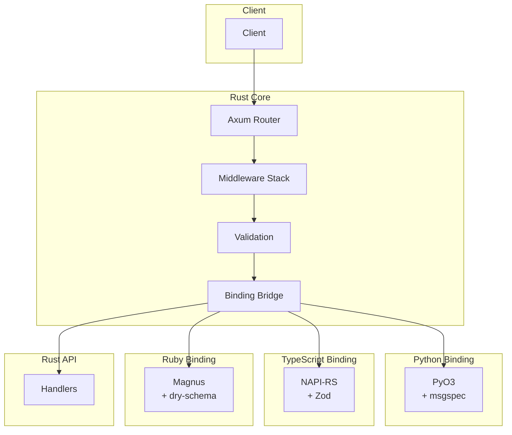

```mermaid
graph TD
  subgraph Client
    A[Client]
  end

  subgraph RustCore[Rust Core]
    B[Axum Router]
    C[Middleware Stack]
    D[Validation]
    E[Binding Bridge]
  end

  subgraph PythonBinding[Python Binding]
    F[PyO3
    + msgspec]
  end

  subgraph NodeBinding[TypeScript Binding]
    G[NAPI-RS
    + Zod]
  end

  subgraph RubyBinding[Ruby Binding]
    H[Magnus
    + dry-schema]
  end

  subgraph RustNative[Rust API]
    I[Handlers]
  end

  A --> B --> C --> D --> E
  E --> F
  E --> G
  E --> H
  E --> I
```
